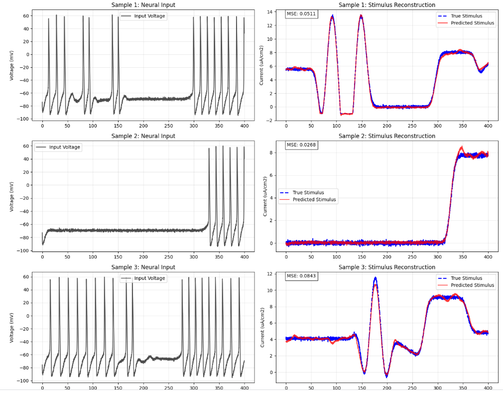
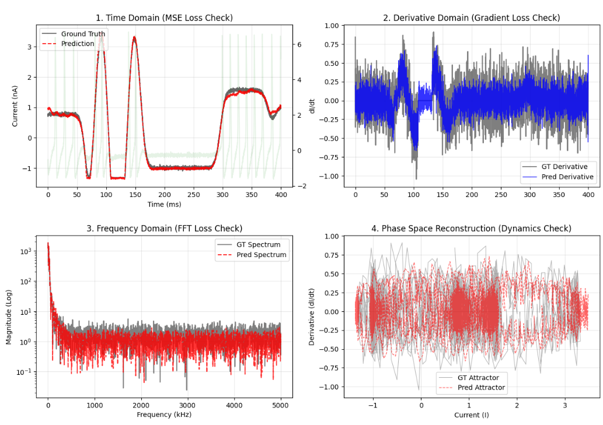
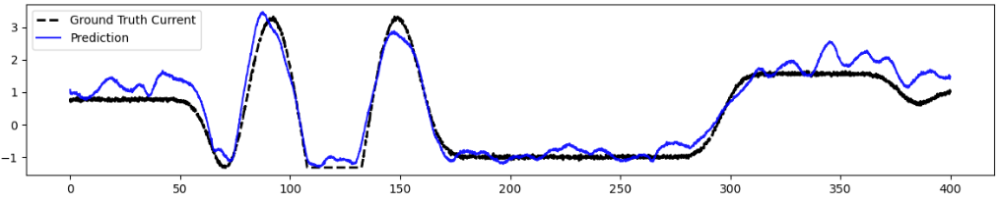
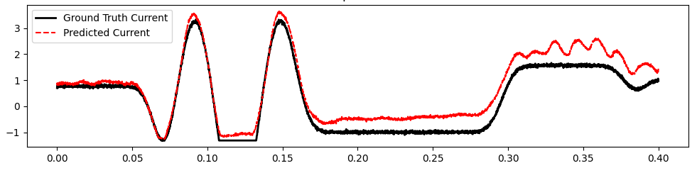

# Inverse-model-for-simulator


This repository contains an implementation of **Inverse Flow Matching** for reconstructing neural stimulation currents from voltage responses. By solving the inverse problem of the Hodgkin-Huxley and Poisson-Nernst-Plank neuronal dynamics, this model predicts the precise input current ($I$) required to generate a target voltage trace ($V$).

The model utilizes a **1D U-Net** architecture conditioned via **FiLM (Feature-wise Linear Modulation)** and is trained with a **Hybrid Spectral Loss** for high-fidelity signal reconstruction.


## 📊 Results (using test set / split entire data set to train/val/test)

| Metric | Value | 
| :--- | :--- |
| **Global $R^2$ Score** | **0.9937** |
| **Avg Correlation** | **0.9952** |
| **RMSE** | 0.2494 $\mu A/cm^2$ | 
| **MAE** | 0.1783 $\mu A/cm^2$ |
<div align="center">
  
</div>

1.  **Time Domain (Signal Fidelity):**
2.  **Derivative Domain ($dI/dt$):**
3.  **Frequency Domain (FFT):**
4.  **Phase Space Reconstruction (Dynamics):**
<div align="center">
  
</div>

## 🛡️ Robustness Analysis: Noise & Drift

Neural recordings in real-world scenarios are rarely clean. They suffer from high-frequency thermal noise and low-frequency baseline drifts caused by electrode instability or movement artifacts.
To evaluate the model's stability under these harsh conditions, we conducted stress tests using **Gaussian Noise** and **Baseline Drift**.
### 1. Test Conditions

| Noise Type | Simulation Method | Real-world Analogy |
| :--- | :--- | :--- |
| **Gaussian Noise** | Added random normal distribution ($\sigma=0.4$) to $V$. | Thermal noise, amplifier hiss, electronic interference. |
| **Drift Noise** | $Amp=0.2$, $Freq=0.4 Hz$ | Electrode movement, breathing artifacts. |

> **Note:** For both tests, the derivative inputs ($dV/dt$, $dK/dt$) were **re-calculated from the noisy/drifted traces** to ensure a realistic evaluation pipeline.
### 2. Performance Observations
Gaussian Noise
<div align="center">
  
  
</div>

Drift Noise
<div align="center">
  
  
</div>

## 📂 Project Structure

```bash
.
├── model.py          
├── train.py         
├── preprocess.py
├── simulator.py
├── raw_data_generation.py
├── requirements.txt
└── README.md         
